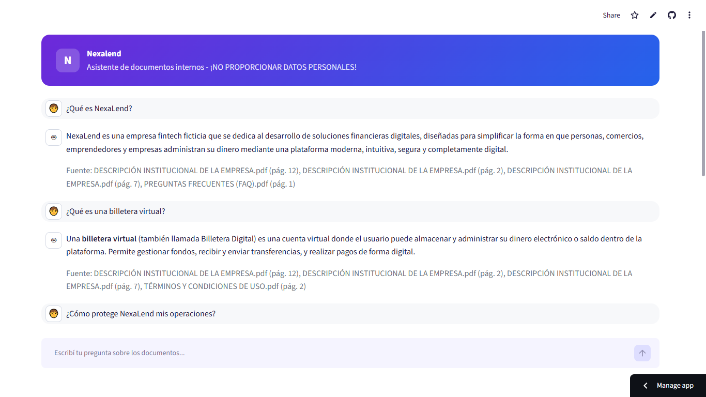

markdown# NexaLend | Asistente de IA sobre documentos internos

Agente conversacional que responde preguntas en lenguaje natural sobre la documentación interna de NexaLend (una fintech), usando **RAG (Retrieval-Augmented Generation)** para fundamentar cada respuesta en el contenido real de los documentos, en vez de depender del conocimiento general del modelo.

---

## Descripción

NexaLend cuenta con múltiples documentos internos (FAQ, términos y condiciones, políticas de privacidad, seguridad, tarifas, soporte técnico, RRHH). Este agente permite consultarlos en lenguaje natural sin necesidad de abrir cada archivo manualmente, citando siempre de qué documento y página sale cada respuesta.

## Arquitectura

````Usuario
│ pregunta en lenguaje natural
▼
streamlit_app.py (interfaz web, paleta violeta/azul/blanco)
│
▼
src/agent.py ── Retriever ──▶ Chroma (vector store) ──▶ data/\*.pdf
│ (ya indexados)
│
└── Prompt + contexto recuperado ──▶ Groq / LLM (openai/gpt-oss-120b) ──▶ Respuesta + fuentes```

1. **`src/loader.py`** (Etapa 1) — recorre automáticamente todos los PDFs de `data/`, extrae su texto con `pypdf` y lo divide en fragmentos (chunks) con `RecursiveCharacterTextSplitter`.
2. **`src/vectorstore.py`** — convierte esos fragmentos en embeddings (`GoogleGenerativeAIEmbeddings`) y los indexa en un vector store local (`Chroma`). La indexación se marca como completa recién al terminar todos los lotes, para evitar quedar con un índice a medio construir si el proceso se interrumpe.
3. **`src/agent.py`** (Etapa 2) — dada una pregunta, recupera los fragmentos más relevantes (Retrieval) y le pide a Groq (usando el modelo openai/gpt-oss-120b) que responda basándose únicamente en ellos (Generation), citando el documento y la página de origen.
4. **`streamlit_app.py`** — interfaz web con diseño propio (tema violeta/azul/blanco), historial de conversación y preguntas sugeridas.
5. **`app.py`** — contiene la lógica compartida de carga/indexación del vector store, reutilizada por la interfaz.

```## Tecnologías utilizadas

| Categoría        | Tecnología                                                                             |
| ---------------- | -------------------------------------------------------------------------------------- |
| Lenguaje         | Python 3.12+                                                                           |
| Orquestación     | LangChain (`langchain-core`, `langchain-text-splitters`), langchain-groq               |
| Lectura de PDF   | `pypdf`                                                                                |
| Embeddings + LLM | Google Gemini (langchain-google-genai) para gemini-embedding-001 + Groq (langchain-groq)
|                    para openai/gpt-oss-120b                                                               |
| Vector store     | Chroma (`langchain-chroma`), persistido en `db/`                                       |
| Interfaz         | Streamlit, con theming y CSS personalizado                                             |
| Deploy           | Streamlit Community Cloud                                                              |
```
## Estructura del proyecto
```
challenge-agente-ia/
├── data/ # documentos base (9 PDFs de NexaLend)
├── src/
│ ├── loader.py # Etapa 1: lectura y chunking multi-documento
│ ├── vectorstore.py # embeddings + Chroma, indexacion en lotes
│ └── agent.py # Etapa 2: cadena RAG
├── .streamlit/
│ └── config.toml # tema visual (violeta/azul/blanco)
├── app.py # logica de carga/indexacion del vector store
├── streamlit_app.py # interfaz web (punto de entrada del deploy)
├── config.py # parametros centralizados
├── requirements.txt
├── .env.example
└── .gitignore
```
## Instalación y ejecución local

```bash
git clone https://github.com/Kiarakuznicki/challenge-agente-ia.git
cd challenge-agente-ia

python -m venv venv
venv\Scripts\activate          # Windows
# source venv/bin/activate     # Mac/Linux

pip install -r requirements.txt

copy .env.example .env          # Windows
# cp .env.example .env          # Mac/Linux
````

Editá `.env` (basándote en `.env.example`) y agregá tus claves de API:

- **GOOGLE_API_KEY**: Se obtiene gratis en https://aistudio.google.com/app/apikey (usada para los embeddings).
- **GROQ_API_KEY**: Se obtiene gratis en https://console.groq.com/keys (usada para la generación de respuestas con el LLM).

````env
GOOGLE_API_KEY=tu_clave_de_google_aqui
GROQ_API_KEY=tu_clave_de_groq_aqui

Ejecutar:

```bash
streamlit run streamlit_app.py
````

La primera ejecución indexa los 9 documentos. Las siguientes ejecuciones cargan el índice ya guardado en `db/` y son instantáneas.

## Ejemplos de preguntas y respuestas

**Pregunta:** [¿Qué es NexaLend?]
**Respuesta:** [NexaLend es una empresa fintech ficticia que se dedica al desarrollo de soluciones financieras digitales, diseñadas para simplificar la forma en que personas, comercios, emprendedores y empresas administran su dinero mediante una plataforma moderna, intuitiva, segura y completamente digital.

Fuente: DESCRIPCIÓN INSTITUCIONAL DE LA EMPRESA.pdf (pág. 12), DESCRIPCIÓN INSTITUCIONAL DE LA EMPRESA.pdf (pág. 2), DESCRIPCIÓN INSTITUCIONAL DE LA EMPRESA.pdf (pág. 7), PREGUNTAS FRECUENTES (FAQ).pdf (pág. 1)]

**Pregunta:** [¿Qué es una billetera virtual?]
**Respuesta:** [Una billetera virtual (también llamada Billetera Digital) es una cuenta virtual donde el usuario puede almacenar y administrar su dinero electrónico o saldo dentro de la plataforma. Permite gestionar fondos, recibir y enviar transferencias, y realizar pagos de forma digital.

Fuente: DESCRIPCIÓN INSTITUCIONAL DE LA EMPRESA.pdf (pág. 12), DESCRIPCIÓN INSTITUCIONAL DE LA EMPRESA.pdf (pág. 2), DESCRIPCIÓN INSTITUCIONAL DE LA EMPRESA.pdf (pág. 7), TÉRMINOS Y CONDICIONES DE USO.pdf (pág. 2)]

**Pregunta:** [¿Cómo protege NexaLend mis operaciones?]
**Respuesta:** [NexaLend protege tus operaciones mediante una serie de controles y tecnologías distribuidos en varios niveles:

Protección de datos

Tokenización de la información sensible.
Hash seguro para las contraseñas.
Gestión centralizada y rotación de claves criptográficas.
Monitoreo y detección en tiempo real

Las transacciones se analizan al instante considerando: frecuencia, montos, ubicación geográfica, dispositivo, horarios, historial del usuario y cambios repentinos en el patrón de uso.
Si se detecta un comportamiento atípico, la operación puede ser retenida para su revisión.
Prevención de fraude

Combina controles automáticos y revisiones manuales para identificar y bloquear distintos tipos de fraude.
Incluye controles antifraude dentro de los procesos de validación de identidad (captura de documento, validación biométrica, comparación facial automatizada, verificación de correo y telefónica).
Seguridad de aplicaciones y APIs

Revisión de código, análisis de vulnerabilidades, pruebas de penetración y validación de entradas.
Gestión segura de sesiones y protección contra ataques comunes como inyección de código o XSS.
Las APIs utilizan mecanismos de autenticación y autorización.
Seguridad de la infraestructura tecnológica

Segmentación de redes, firewalls, balanceadores de carga y sistemas de detección y prevención de intrusiones (IDS/IPS).
Protección contra ataques DDoS, monitoreo de disponibilidad, gestión segura de configuraciones y copias de seguridad periódicas.
Protección de redes

Todas las comunicaciones entre usuarios y la plataforma se realizan mediante protocolos cifrados.
Con este conjunto de medidas, NexaLend busca garantizar la confidencialidad, integridad y disponibilidad de tus operaciones y datos.

Fuente: POLÍTICA DE PRIVACIDAD Y PROTECCIÓN DE DATOS.pdf (pág. 7), POLÍTICA DE SEGURIDAD Y PREVENCIÓN DE FRAUDES.pdf (pág. 6), POLÍTICA DE SEGURIDAD Y PREVENCIÓN DE FRAUDES.pdf (pág. 7), POLÍTICA DE SEGURIDAD Y PREVENCIÓN DE FRAUDES.pdf (pág. 8)]

**Pregunta:** [¿Qué deportes juegan los empleados de NexaLend?]
**Respuesta:** [No encontré esa información en el documento.

Fuente: DESCRIPCIÓN INSTITUCIONAL DE LA EMPRESA.pdf (pág. 10), POLÍTICA DE PRIVACIDAD Y PROTECCIÓN DE DATOS.pdf (pág. 13), PREGUNTAS FRECUENTES (FAQ).pdf (pág. 1)]

## Deploy

**Nota sobre la plataforma elegida:** Se optó por **Streamlit Community Cloud** por tratarse de la plataforma nativa del framework de la interfaz (Streamlit), lo que permite un despliegue continuo directamente desde este repositorio de GitHub, sin necesidad de gestionar infraestructura de servidor por separado.

- **URL pública:** https://challenge-agente-ia-m83srbauwlccweayczlomi.streamlit.app/
- **Evidencia:** 

## Limitaciones conocidas

- La app se "duerme" tras un período de inactividad prolongado (comportamiento estándar de Streamlit Community Cloud); la primera visita tras la inactividad puede tardar unos segundos más en responder.

## Autor

Kiara Kuznicki — Challenge Oracle + Alura, Generación G1
